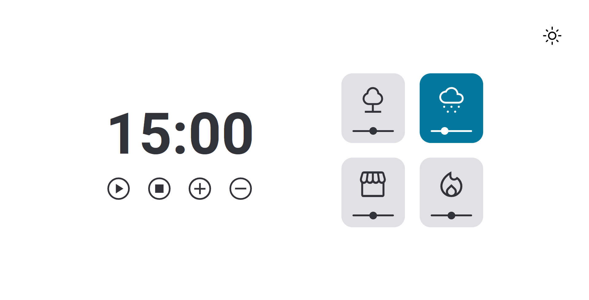
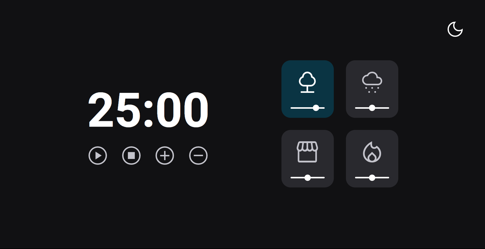

# Focus Timer ⏰
  

 How do you stay organized? How do you handle your studies or work? It's evident that all the distractions, interruptions, and the lack of focus and motivation contribute to your confusion and disorganization. For many people, time is like an enemy. So, the main aim of this project is to make time our valuable ally, helping us achieve what we want and the way we want it, and empowering us to continuously improve our work or study processes. 

#
<h2> <strong>Functionalities</strong>  </h2>

The function of the button in the top right corner is to toggle between Light Mode and Dark Mode.

- **Play / Pause**: activates / pauses the timer;
- **Stop**: stops the timer;
- **(+)**: increases the timer time by 5 minutes;
- **(-)**: decreases the timer time by 5 minutes.

 Every card on the right side, when you select it, changes its color and produces a different sound linked to the forest, rain, café, or fireplace. Moreover, you can adjust the volume using the slider beneath each icon. By default, clicking anywhere on a card sets the volume to 50%. 

#

#### <h3 align="center">**That project was developed with** </strong></h3>

#### <h3 align="center">HTML | CSS | JavaScript | Figma | Git | GitHub </h3>

#

- [time to focus! click here](https://anaaaab.github.io/focus-timer)

#
  

<strong>Made with 🤍 by Ana Paula Bertuol </strong>

  

#### 
[Access my profile on LinkedIn here](https://www.linkedin.com/in/ana-paula-bertuol/) 
